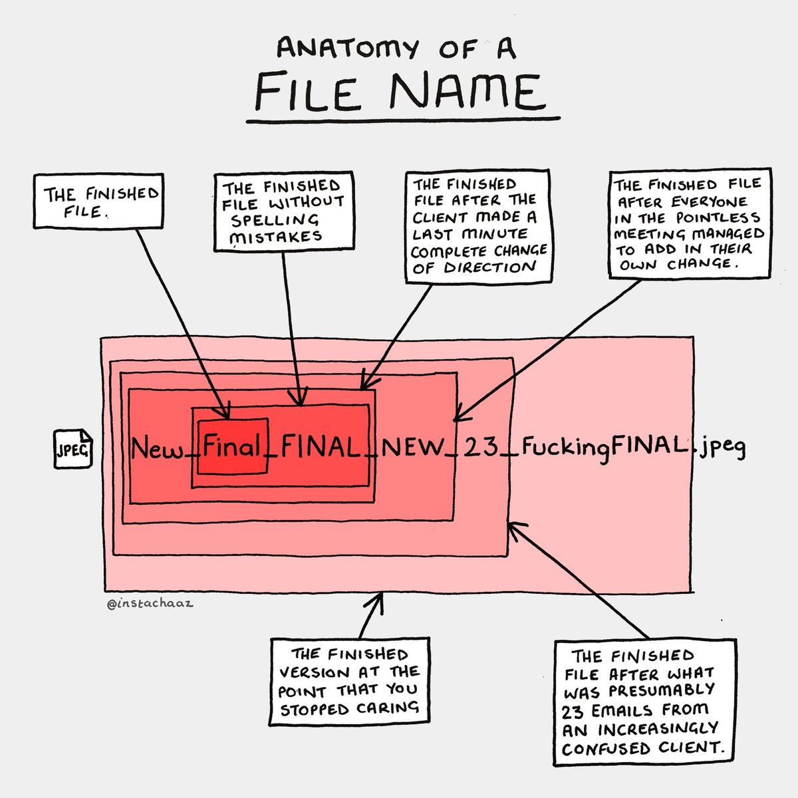
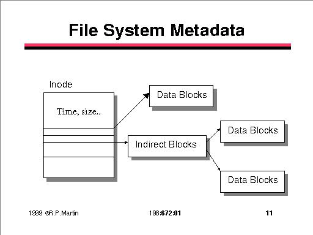

# Hashing

Day 1: explain git.

Day 2: the rest

---

# What is Hashing?

> A cryptographic hash function is a one way mathematical function that maps data of an arbitrary size to a bit array of fixed size.  The output bit array is commonly called a hash or digest. -Wikipedia

Key tenets of a hash algorithm:

1. ***Fast***, must not take a lot of resources or time to compute

2. ***Irreversible***, must not be able to retrieve the original data from the resulting hash (one way transformation)

3. ***Deterministic***, for the same input value, a hash function must always provide the same output

4. A small change to the input should result in large change to the hash value (***avalanche effect***)

---

# In english

A fancy algorithm that converts a variable length input data to a fixed length output data with the following constraints:

* same input == same output
* different input == ***MASSIVE*** likelihood of different output
* output data reveals ***NO*** information about the input data
* must be **collision resistant**

---

# File names

---

# Data (again)

  
---

# Again

* same input == same output
* different input == ***MASSIVE*** likelihood of different output
* output data reveals ***NO*** information about the input data
* must be **collision resistant**

What is a "collision"?

---

# Ship

---

# Plane

  

---

# Hashing algorithms

| Hashing Algorithm | Hash size (bits) | Hash size (hex length) | Collision-resistant |
| --- | --- | --- |:---|
| MD5 | 128 | 32 | no |
| sha256 | 256 | 64 | yes |
| sha512 | 512 | 128 | yes |
| NTLM | 128 | 32 | no |

---

# What is Hashing used for:

* verify the integrity of data (block chain, downloads, git commits, secure software)
* digital signatures
* as a part of verifying a given users *Authenticity* (a part of *Authentication*)
* Proof-o'-work (mining, defense against Denial of Service)

---

# Follow along (in `bash`) for some data science fun:

What is the difference between the following:

* `echo "Hi!"`
* `printf "Hi!"'`  <----- Hint: Use this one for the exercise

What do the following do?

* `|`  The pipe character
* `awk -F ',' '{ print $1 }'`   Hint: pipe the `cat` output of quiz-data.csv into this
* `grep <string>`  

Now about the quiz data, can we reverse our hash?

---

# What are some common (semi) unique identifiers for people?

* campus W-number
* campus UID
* Social Security Number
* First initial Last name combo ie. `MKijowski`

---

# Day 2 Hashing

[Don't believe everything you read on the internet.](https://towardsdatascience.com/anonymizing-data-sets-c4602e581a35)

---

# Attacks on hashes 

* Brute force: hash everything (worst case scenario)
* Pass the hash: an authenticating system accepts hashes, and you have them
* Dictionary attack: you have a dictionary of likely input data used to compute hashes
* Rainbow table: you have a dictionary of pre-computed hashes and known input data
* Collision: you guess/compute ***different*** data that computes to the same hash value

---

# Nonce and salt

Both added to data prior to the hashing function to increase uniqueness.  Used for different reasons though.

* Salts increase complexity and prevent several known attacks on hash values (dictionary and rainbow table attacks)
* Nonce's are unique (number used only once) and are used to prevent replay attacks (cannot use same nonce) and in proof of work
* These do not increase any guarantee of integrity!!

---

# Key stretching

Suppose an attacker has the salts and hash values and can guess at the original data used...

To make things harder for an attacker, we can simply apply the hashing algorithm to the output of the first.

Do this multiple times to *stretch* (lengthen) the time it takes to attack the hash using common disctionary attacks.

---

# Proof of Work

Proof of an amount of work prior to participating.

Created to reduce email spam.

Example: include a nonce that hashes to *X* number of leading 0's (see Hashcash)

---

# Lets talk lab 1

* 10 commits == 10 points
* style == 10 points

* task 1 == 50 points (15 points for salted quiz data set)
* task 2 == 50 points (15 points for coins)

---

# Lab 1 continued

* `data/` : folder containing data for use in this lab
* `miner/` : folder for your mining code
* `LAB1-INSTRUCTIONS.md` : mardown file containing lab instructions
* `README.md` : markdown file for your answers and lab writeup.  This is the file I am grading (as well as other requested files)
* `coins.txt` : file with your nonce/word combos, no hashes in this file please!

---

# Markdown Style

* Answers/ responses should be on a new line and not require scrolling around the page (be carefull of code blocks).
* Check the style guide in the course repository for more details!!

---

# Git

[Anatomy of a git commit](https://blog.thoughtram.io/git/2014/11/18/the-anatomy-of-a-git-commit.html)

---

# Homework

* Research some effective and ineffective password strategies (google it...)
* Make a new linux user with a weak password (pleased dont use the top 10)
* Copy the above users weak password hash (corresponding line in `/etc/shadow`) and submit to Pilot.
  * It should look something like this: `mynewuser2:$y$j9T$hBy.nN91qFxXxCMP...`
* Get started on your lab!!!

