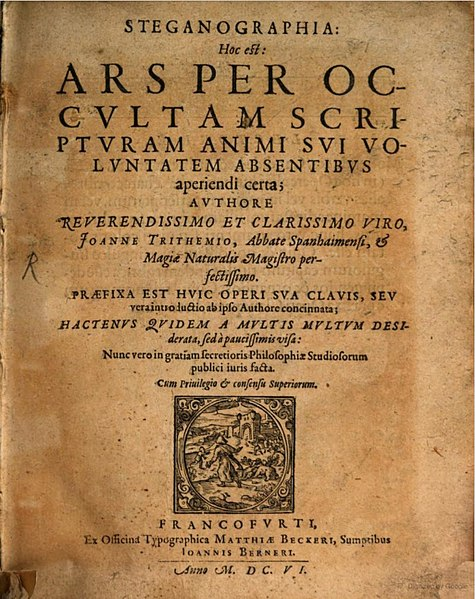
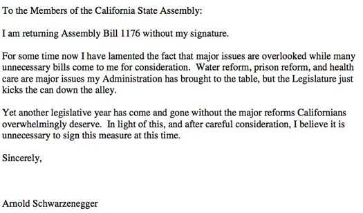
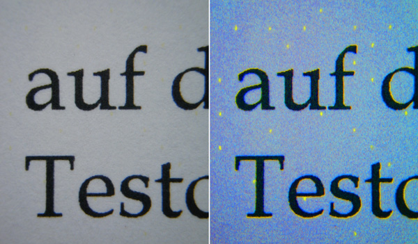
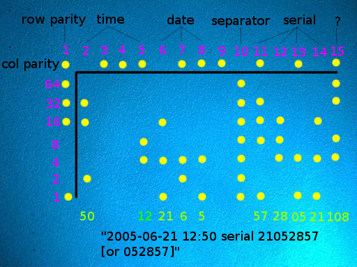
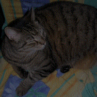

# [Steganography](https://en.wikipedia.org/wiki/Steganography)

The art of hiding in plain sight.

* What is steganography?
* Why is steganography?
* Where is steganography?
* Who is, just kidding, we're doing examples :p

---

# What is Steganography

If encryption can be thought of as the encoding of data for confidentiality,
then steganography is the encoding of data to obscure the fact that the data
is there at all.

---

# But why?

* Encryption can be noisy / obvious.
* So are most backdoors, remote commands, random network ports
* How can we transmit data between two parties when we know  that even the *detection* 
  of a transmission could cause harm?

---

# When



First recorded use 1499, although writings from ancient Greece (~440 BC) mention ways to pass messages unseen.  

---

# Where

Anywhere we can think to hide data.

* On a messengers scalp, allowing hair to regrow before sending ~440BC
* Written on the wood of a wax tablet before wax was applied ~440bc
* Published in a major work ~Steganographia 1499
* Written to an alternate track mode on a floppy ~1970s
  * [40 track mode](https://en.wikipedia.org/wiki/40-track_mode)
  * [Robert Hanssen](https://en.wikipedia.org/wiki/Robert_Hanssen)

---

# Where else, text!

* Encoded in the first letter of each line:



---

# Where else, more text!!

* In a [plain text file](data/batman.txt)

```txt
____________________________________________	     	    	      	      
| Great work, you've found my secret lair! |  	      		 	   
| the flag is nananananananana+batman      |    	      	     	       
--------------------------------------------     	  	    	 
   \      .  .    		   		      	   	    	   
    \     |\_|\      	  	   	  	 	  	 	  
     \    | a_a\ 	      	       	   	     	   	 	      
          | | "] 	       	     	  	      	   	     	      
      ____| '-\___     	       	    	 	    	   	  	       
     /.----.___.-'\ 	  	     	       	 	   	    	 
    //        _    \	     	       	  	      	 	    	 
   //   .-. (~v~) /|  	      	      	   	     		   	      
  |'|  /\:  .--  / \	       	  	      	  		 	   
 // |-/  \_/____/\/~|	 	   	   	 
|/  \ |  []_|_|_] \ |
| \  | \ |___   _\ ]_}
| |  '-' /   '.'  |
| |     /    /|:  |
| |     |   / |:  /\
| |     /  /  |  /  \
| |    |  /  /  |    \
\ |    |/\/  |/|/\    \
 \|\ |\|  |  | / /\/\__\
  \ \| | /   | |__
       / |   |____)
       |_/
```

---

# Whitespace encoding with `stegsnow`

Notice anything weird about the previous slide?

* You can decode a secret message using a tool called `stegsnow`

```txt
Nothing fishy here...  The flag is wealthy+philanthropist
```

---

# Text (printed to paper)



In 2015 it was discovered that all major printer manufacturers entered into a secret agreement with
governments to ensure that the output of their printers was forensically traceable. [*-Wikipedia*](https://en.wikipedia.org/wiki/Machine_Identification_Code#cite_note-11)

---

# Machine Identification Code (MIC)



---

# Images


* Contains the entire work of William Shakespeare.
* done by fiddling with `.zip` and `.jpg` headers

---

# Images of Cats


* Contains a picture of a cat
* Picture is encoded in the two Least Significant Bits (LSB)

---

# The actual cat pic



* Is a picture of a cat
* Probably hates me

---


