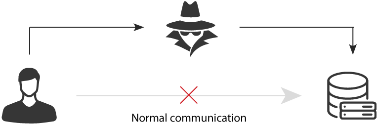

# Network Attacks and Defenses

Questions on lab or hw grades?

---

# Todays Goals

Introduce the following common *Network Attacks*

* Unauthorized Access
* Port Scanner
* Denial of Service (DoS)
* Man in the Middle (MitM)
* Code injection / Command Injection
* Cross-site scripting (XSS)
* Insider Threats

And the following Network Defense tools

* Endpoint Protection 
* Intrusion Detection System (IDS)
* Intrusion Protection System (IPS)
* Managed Detection and Response (MDR)

---

# Denial of Service (DoS)

* Meant to shut down a machine or network.
* Commonly done using a large number of infected machines, called a botnet.
  * In this instance a DoS becomes a Distributed Denial of Service or DDoS
* Script kiddie level stuff but still can have a very harmful effect
* Firewalls are only effective if they can handle the load...

---

# Port Scanning

`nmap`  

That is all.

seriously...

---

# Unauthorized access

Broad category of attacks that involve an attacker gaining access to
a system/account.

* session highjack
* default accounts
* Cross-site request forgery [CSRF / XSRF](https://owasp.org/www-community/attacks/csrf)

---

# Man in the Middle (MitM)



Typicall Eavesdropping attack

Commonly granted via

* ARP spoofing  (Who has what address, overflow)
* Rogue Access Point ([Wifi pineapple](https://shop.hak5.org/products/wifi-pineapple))
* DNS spoofing

Can give an extraordinary amount of access depending on *where* in the 
middle.

---

# Code injection / Command Injection

* User input containing malicious data  
* SQL injection attacks are common (SQL database for web backend)
* Other things commonly injected are 
  * Basic linux commands 
  * Whole files / programs worth of code.

---

# Cross Site Request Forgery (CSRF)

Tricking a user into performng some action.  Three requirments for there to be a vulnerability:

* **relevant action** (such as change email or deposit funds)
* **active session** (user is logged into the desired service and has a token/cookie)
* **predictable request parameters** (attacker knows how to craft the request)

Constructing a XSRF can be cumbersome, but there are tools to automate.

```
 
```

[CSRF labs and info](https://portswigger.net/web-security/csrf)

---

# CSRF Continued

## Typical actions that are targeted:

* Change password/user/email
* Perform login
* Perform download (malware)
* Transfer funds

## Prevention

* Do not allow `GET` requests for state changing actions
* Require `POST` requests come from a verified domain
* Require CSRF *tokens* (unique identifiers used only once) to validate requests
  * basically invalidates rule 3 **predictable request parameters** since token is not predictable

---

# Cross-site scripting (XSS)


---

# XSS continued

Two broad categories:

* Reflected XSS
  * vulnerable site accepts malicious data from user (single target user)
* Persistent XSS
  * vulnerable site stores malicious data from a user (all users are targets)

Magecart (2018) 

  * Reflected XSS that evaded detection in some interesting ways.

---

# XSS and CSRF

A sophisticated attacker may use both in conjunction to perform advacned attacks!!!

This may be able to get around CSRF tokens if a sufficiently advanced script captures the unique CSRF identifier and sends it to an attacker...

---

# Insider Threats

I think we talked about this before...

* Malicious users
* Negligent users
* Infiltrators (Unauthorized access)

Hire good people, train them, and treat them well...

Be sure to have good policies surrounding hiring and terminiation.

---

# Network defenses

Endpoint Protection 

* Should have been covered in host security
* Started as virus scan
* Has evolved to cover a lot more ground at the endpoint

---

# Intrusion Detection and Protection Systems (IDS/IPS)

A key part of endpoint protection is intrusion detection and prevention.

2 main ways of detecting intrusions

* Rule-Based
  * Identify attack signatures to look for 
  * Alert if any rules (attack signatures) are seen
  * fewer false positives, but novel (new) attacks can be missed

* Statistical
  * a standard profile is built from a statistical representation of 
    normal activity
  * Alert if abnormal activity is detected
  * more false positives, but novel (new) attacks can be caught

---

# Managed Detection and Response (MDR)

Matt begins yelling at the moon...

* Latest buzzword
* *Managed*
* Security as a Service
* Lets a security team blame someone else

