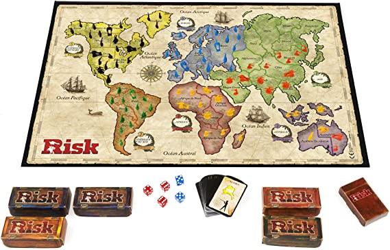
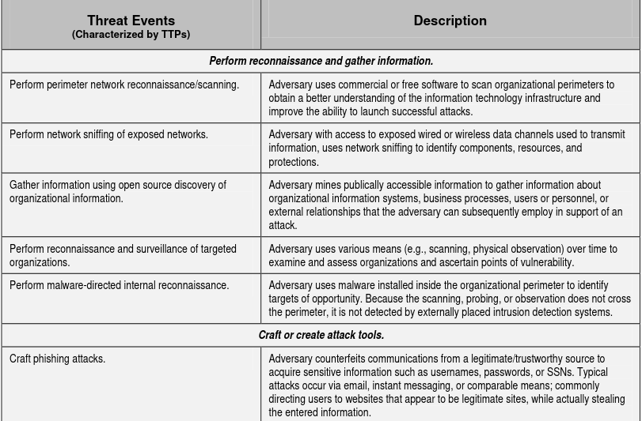

# CEG 3400 : Risk

\*Not the board game

---

# Risk

Today we are going to cover the following:

* Risk Profile
  * Risk Appetite
  * Risk Tolerance
  * Risk Capacity
* Risk Management
* Threat Modeling
* Risk Assessment tools

---

# What is Risk?

{height=40%}

*noun* a situation involving exposure to danger.

*verb* expose to danger, harm, or loss.

---

# Risk Profile

* **Risk Appetite** the risk *NEEDED* to achieve goals
* **Risk Tolerance** how comfortable you feel about this risk AKA, the risk you *PREFER* to take
* **Risk Capacity** the risk you can *AFFORD* to take

{height=80%}

---

# Lets practice

NIST Special Puplication 800-30 : Guide for Conducting Risk Assessment

Lab 6 is all about risk assessment.

---

{height=80%}

---

# Lab 6

* You alone are the entire C-suite of a new startup ***Your Name Inc.***.

* The business purpose of this startup is to facilitate you graduating and 
  getting an awesome job while maintaining some semblence of sanity (this is a joke, 
  stay healthy kids).

* Insiders in your organization are anyone currently living with you or 
  sharing an account.

* Purpose of this assessment: familiarize the board of ***Your Name Inc.*** 
  with basic risk assessment practices and identify any high risk items that
  might impede your organizations objectives.

---

# Risk Management

Understand, analyze, and address risk to make sure the organization achieves its goals.

* Continuing process (repeats)
* Before you understand your risk you need to identify them
* Your entire organization will get this wrong (everyone does)
* Your organization will perform this better than some multi-million $ companies (see last point)
* Humans (and Mark Zuckerberg) perform risk managment every day

***Matt Hanon***

---

# Matt Hanon

* Wired.com author
* Twitter nerd
* apple fanboy
* used apple's me.com
* Gmail user
* also bought items on amazon.com

---

# The Hack

::: columns

:::: column

{height=15%}

::::

:::: {.column width=15%}

{heigh=5%}

::::

:::: column

{height=15%}

::::

:::

--- 

# Lab 6: Scope

* `nmap` scan of your home network (with permission)
* all other networked and non-networked electronic devices
* all online accounts with non-directory information
* all pertinent data about you that might cause harm
* time frame is from today until after your first month of a CS/Cyber/IT job

---

# What are we doing?

* Policies: Confidentiality, Integrity, Availabilty
* Threat Model: assumptions about our adversaries
* Mechanisms (SW, HW, procedure etc.) that achieve org goals and maintain our policies

---

# But you did not have the word risk in that last slide...

Well before we can assess risk we need to understand the threats we may be facing.

2 types of threats we are going to focus on:

* Non-adversarial
* Adversarial

---

# Non adversarial

* Accident
* Human Error
* Structural failure
* Environmental

See NIST 800-30 Table E-3.

---

# Adversarial

Deliberate actaions of a third party with ***intent*** to cause organizational
disruption or loss.

Who are our adversaries and what are their capabilities?

* Hackers
* Script Kiddie
* Cyber Criminals
* Cyber Terrorists
* Hacktivists
* State-Sponsored attackers
* That one cousin who cant stand to see you succeed and is actively sabotaging your graduation
* That one person from ITinder that you swiped right on, had dinner with, then ghosted

---

# From Day 1:

{height=50%}

---

# 1. System Susceptibility

Is the system able to be attacked?

Questions to ask:

* Does it have value to attackers?
* Thats about it...

Mitigations:

* Inventory (for CVE tracking by CPE, also to assign value)
* CVE's
* Good IT and coding standrads / practices

---

# 2. Threat Accessiblitiy

Questions to ask:

* What is your attack surface?
* What is the logical and physical reachabilty?

Mitigations:

* Inventory (better describe your attack surface)
* Phycial security (prevent physical access)
* Network architecture and Firewalls (prevent logical access)
* User accounts with good atuhentication (multifactor)

---

# 3. Threat capability

* For each threat source, do they have the necessary tools / techniques / resources to attack *a given vulnerability*
  that they *have access to*.

Assumptions: 

1. There exists a vulnerability
2. That vulnerablity is accessible

Mitigation:

* Remove access
* Patch or remove vulnerabilities
* Understand what your adversaries are capable of (ATT&CK, threat modeling  

---

# What can our adversaries do? 

Nist 800 30 Table E-2

---

# Where are we weakest

Identify all vulnerabilities and predisposing conditions that affect the 
likelihood of a threat event causing adverse impact.

---

# Determine Likelihood

What are the chances of a threat event occuring that results in adverse impact.

Consider the following:

* charactersistics of threat source
* vulnerabilities identified
* susceptibility given the safegaurds/countermeasures the org has in place 
  to prevent or impede such an event

---

# Determine impact of event

Assuming the event occurs, what is the impact of that event.

---

# Determine Risk

Based on the likelihood of an event occuring and the impact from that event
should it occur.

--- 

# What do we get out of all this

*Hopefully* two things.

1. A better understanding of your overall risk profile, which can inform
   decision making around better mechanisms to protect the organization.
2. A priority ranking of threats as they would impact your organization,
   given limited resources this will focus your organizational spending
   on security mechanisms for a higher Return On Investment

---

