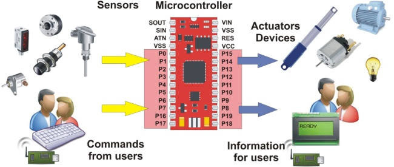

# Internet of Things

* Embedded systems
* Internet of Things (IoT)
* Non TCP/IP Wireless
* Security challenges

---

# Risk recap 

* `nmap` scans and network ownership
* Multiple CIDR's
* Risk = **f(***Overall likelihood*, *Impact***)**
* Overall Likelihood = **f(***likelihood of occuring*, *likelihood of adverse impact***)**

---

# Embedded systems

> Computing hardware and software contained within a larger system 
  (typically designed for a specific function)

* **They're everywehere!** (They being computers)
* Examples:
  * Medical devices
  * Vehicles (aircraft, cars, etc.)
  * Industrial machines and fabrication
  * Heating, ventilation, and air conditioning (HVAC)
  * "Smart" home (lights, dishwashers, etc.)
  * Sensors/alarms/security
  * etc.

---

---

# Common traits of embedded systems

::: columns

:::: column

* Autonomous
* Cloud controlled
* Dynamic
* Functional requirements may change over time
* Network of devices
* Cascading failures 
* Duplicate devices
* AI/ML (Artificial Intelligence / Machine Learning)
* Multiple sensors and actuators
* Privacy and safety concerns!!!

::::

:::: column

::::

:::

---

# Embedded Systems Security issues

* Requires different security techniques from standard desktop computing 
  * Cost sensitive (cheaper devices make more sense in large quantities)
  * Energy constraints (batteries)
  * Computing constraints (low processor power)

* Potnetial Threat events similar to desktop computing
  * Interception / eavesdropping
  * Fault generation / denial of service
  * Fabrication / forgeries

* Software + Hardware security!

---

# Internet of Things (IoT)

> The Internet of things (IoT) describes physical objects (or groups of such objects) that are embedded with sensors, processing ability, software, and other technologies that connect and exchange data with other devices and systems over the Internet or other communications networks. *-Wikipedia*

---

# Interconnected

### Short-range wireless
  * Wi-Fi (TCP/IP traditional networking over Radio Frequencies) *~100 meters*
  * Li-Fi (TCP/IP traditional networking over infrared/visible light frequencies) *~10 meters*
  * Near-field comminications (NFC) *~20 centimeters*
  * Bluetooth *~50 meters*
  * RFID *~100 meters*
  * ZigBee *~30 meters*
  * ZWave *~100 meters*

### Medium-range wireless
  * LTE *~10 kilometers*
  * 5G *~1 kilometer*

### Long-range wireless
  * Low-power wide-area networking (LPWAN) *~1,000 kilometers*
  * Very small aperture terminal (VSAT) *~10,000+ kilometers*
  * Deep Space Network (DSN) *~millions of kilometers*

---

# IoT security

* Hardware
  * Remote and vulnerable
* Software
  * updates
  * default credentials
  * ***in***security by obscurity
* Data
  * where?
  * Eavesdropping
* Safety
  * frequently IoT devices can control something physical
* Interconnectedness
  * weakest link (IoT devices can be controlled by other devices)

