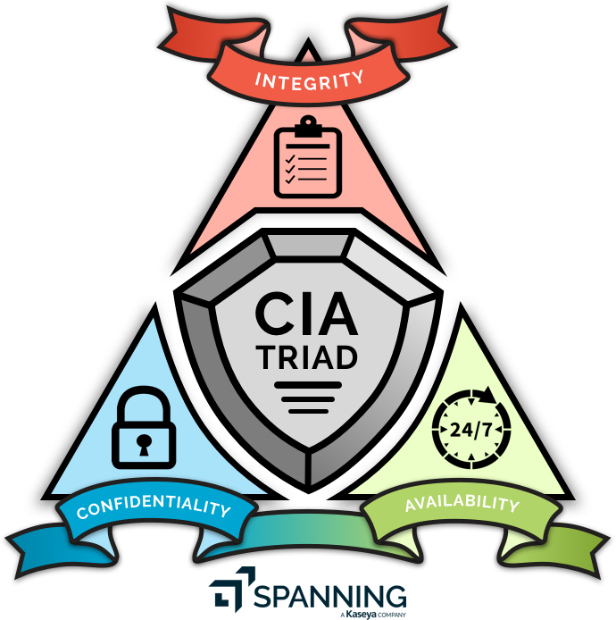

# Lecture 1 - A Clear and Present Danger

Truth needs a soldier

---

# Today's Objectives

* Midterm: Thursday Oct. 6 in class
* Cover changes to syllabus (Final date is Thursday, December 8, 2022  10:15AM - 12:15PM 355 Russ)
* Define Cyberspace
* Define Information Security (CIA triad)
* Define Cyber Security
* Take a (bogus) quiz
* Define Risk
* Define Vulnerability
* Define Threat
* The Risk Management cycle
* Homework

---

# What is [Cyberspace](https://en.wikipedia.org/wiki/Cyberspace)?

Cyberspace is a domain characterized by the use of electronics and the electromagnetic spectrum to store, modify,
and exchange **data** via networked systems and associated physical infrastructures. 

In effect, cyberspace can be
thought of as the interconnection of human beings through computers and telecommunication, without regard to
physical geography.[1](http://searchsoa.techtarget.com/definition/cyberspace)

---

# What **data** are we talking about?

Go take the quiz (Reminder, this quiz is bogus, I will be sharing all responses with the class, the only way to fail it is not take it)!

Sure did take a while to bring up the human beings in all this...

---

# What is the CIA triad [Information Security](https://en.wikipedia.org/wiki/Information_security) model?

{height=90%}

---

# Confidentiality

**Confidentiality**: ensure only authorized access to needed data.  Prevent unauthorized access AND access to unnecessary data.

Ways to protect confidentiality: 

* encryption
* access control/file permissions
* authentication

---

# Integrity

**Integrity**: ensure the data is correct, authentic and reliable (trust).

Ways to protect integrity:

* hashing
* backups
* access/control (virtual and physical)
* data access audits
* data correcting code

---

# Availability

**Availability**: ensure the data is available to authorized users

Ways to protect availability:

* redundancy
* physical protections
* backups
* access controls

[CEG 4750 Information Security](https://catalog.wright.edu/preview_course_nopop.php?catoid=17&coid=95990)

---

# What is Cyber Security?

Simply apply the CIA triad to Cyberspace: Ensure the ***confidentiality***,
***integrity***, and ***availability*** of all data in the cyber space domain.

Easy-peasy right?

---

# HA... no

Cannot guarantee our previous slide.  Lets set some more realistic goals:

* Ensure protective measures to prevent/deter attacks
* Ensure measures to prevent total collapse of system when attack ***does*** occur
* Ensure recovery from attacks in a timely manner (ASAP)

---

# What is Risk

{height=50%}

The intersection of a vulnerability, a threat, and an opportunity (or availability).

---

Even more specifically, a risk must have an impact, meaning it results in the 
loss of confidentiality, integrity, or availability of our data, OR the loss
of something else we care about (loss of life, income, asset, value, etc.) 

---

# Some (more) definitions 

***Vulnerability*** A weakness that can be exploited.

***Threat*** A person or thing likely to cause harm.

***Attack Vector*** A means of access for a threat to reach its intended target.

---

# Common Threats and Threat Actors:

* Malicious Software (software with intent to do harm)
* Software bugs (software without intent to do harm)
* Insider threats (trusted person with intent to do harm)
* ID 10 T errors (trusted person without intent to do harm)
* Outsider Threats
  * Hackers (White Hat, Black Hat, Gray Hat)
  * Script Kiddies
  * Hacktivists
  * Competitors
  * Brokers
  * Cyber Terrorists
  * State-Sponsored Actors
  * Advanced Persistent Threats

---

# Some stats on APTs

USA - 71

EU/ME - 177

APAC - 204

*As reported by FireEye, 2018*

---

# Common Attack Vectors

* Email
* Social Media
* Wireless
* Removable media/devices
* Direct access
* Supply chain
* Cloud (complexity)

---

# So what do we do?

## The Risk Management cycle:

1. Information gathering:

  * Identify data and assets
  * Identify threats
  * Identify vulnerabilities
  * Identify impacts

2. Evaluate Risk

3. Decide:

  * avoid
  * mitigate
  * share
  * accept

---

# Repeat this cycle, forever...

Does anyone notice any problems or flaws with this cycle?

* 7.9 Billion people
* 21.5 billion interconnected devices
* 

---

---

# Homework

1. Make an account on Github!

2. Get your environment ready (install WSL Ubuntu and Mobaxterm)

1. [Watch](https://www.youtube.com/watch?v=2BldESGZKB8) 

2. Read what a [hash function](https://en.wikipedia.org/wiki/Hash_function) is. (read the intro and overview)

3. Be familiar with using `md5sum` and `sha256sum` (be able to hash a file or string)  Hint:  `sha256sum -t "test"` should be the same as `sha256sum filename` if the contents of the filename is just the string text

4. Read this: https://auth0.com/blog/adding-salt-to-hashing-a-better-way-to-store-passwords/#Attacking-Unsalted-Passwords

### Discuss in Discord if you hit any walls!

