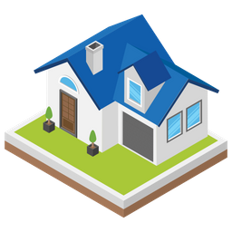
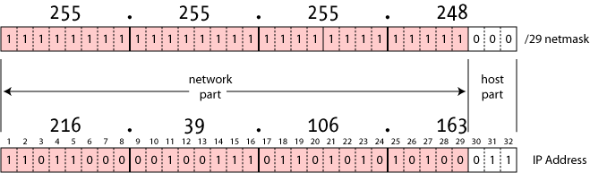

# Networking (Host perspective)

* A note about ethics
* IP addresses
* Mask
* Route
* LAN/WAN
* Ports
* Routers

---

## Ethics/Laws (from a non-lawyer)

---

## Ethics cont.

Questions to ask yourself:

* Do I own / have permission from the owner?
  * Even attempted breaking and entering is frowned upon
* Would I bother anyone else by doing this?
  * Keep in mind you are frequently not the only user of a network or resource
* Might anyone consider this abnormal / malicious?
  * Keep in mind sys-admins all along the way can see your traffic
* Is this going to cost me or the owner anything?
* How is the system likely to react?

---

## IP addresses

---

## Mask

* A network mask (netmask, subnetmask) is the dividing line between the host part and network part of the IP Address.
* The mask determines how many hosts are available on the local network before needing more advanced network configuration for communications.

* Can be specified itself or via CIDR notation (/`number of bits in network part of IP`)

* `192.168.1.100` `255.255.255.0` -> `192.168.1.100/24`

---

## Route

* A Local Area Network or LAN includes all possible IP addresses within the 
  range of the IP address and subnet specified by the subnet mask.
* In order to reach IP addresses outside of this subnetwork, you need a `route` to them.
* **gateways** and **routers** are host systems with specialized software to support
  routing network traffic between different networks
* A `route` consists of a Destination network (IP/subnet) and an IP/subnet for a specified **gateway**.
* **routers** typically have other software as well (firewall, DHCP, etc.)

---

## LAN/WAN

* Local Area Network
  * The subnet that your host system is connected to
* Wide Area Network connecting multiple LAN's together

| 	CIDR block| 	Address range |	Number of addresses | *Classful* description |
| ---         |     ---       | ---  | --- |
|	10.0.0.0/8 |	10.0.0.0 – 10.255.255.255 |	16777216 | 	Class A|
|	172.16.0.0/12 |	172.16.0.0 – 172.31.255.255 | 1048576 |	Class B |
|	192.168.0.0/16 |	192.168.0.0 – 192.168.255.255 |	65536 |	Class C |

---

## IP communications

All data is sent in **packets** with a standard format.

---

## Enter TCP

* TCP is commonly used alongside IP to facilitate communications between applications on different hosts on a network.
* The TCP segment is standard part of the data included in an IP packet.

---

## Ports

[List of common TCP ports](https://en.wikipedia.org/wiki/List_of_TCP_and_UDP_port_numbers)

---

## Firewalls

* Access Control List (ACL) that controls flow of packets.
* Can specify Networks, Hosts, IPs, Ports, and some other methods to allow/deny/manipulate network flow.
* Still hand-wavy till next week

---

## Routers

* DHCP for automated network configuration

